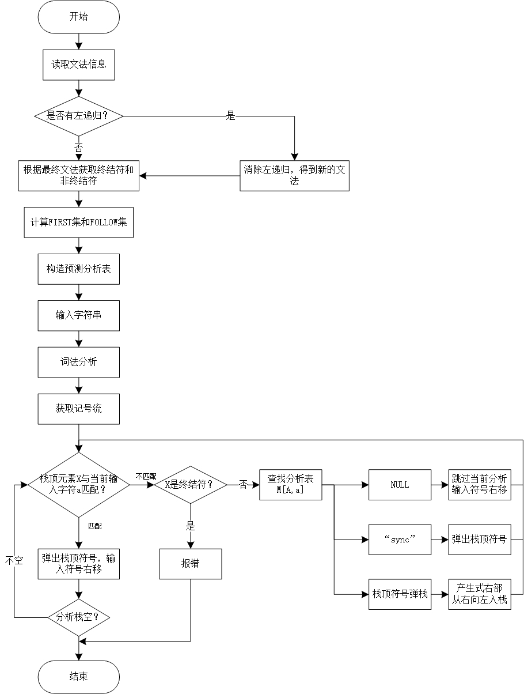

# 简易LL(1)分析器自动生成程序

## 一、前言

这是编译原理的一个课程设计作业，由于`GitHub`的`Markdown`文件对公式的显示效果不佳，建议在`CSDN`上阅读该设计报告项目，[链接在此](http://t.csdnimg.cn/ps8do)。

由于使用的是`Kotlin`编程语言，建议使用`idea`创建并运行项目，`Kotlin`可以与`Java`互相转换。因为使用了`org.apache.commons.lang3.StringUtils`工具，请将`lib`文件夹下的`jar包`（已提供）包含在你的项目结构中。准备就绪后，运行`MyTest.kt`文件就可以在控制台看见测试结果。

若对你有帮助，还请点个赞，谢谢！

## 二、课程设计目的与任务

### 2.1 设计目的

通过设计、编制、调试一个可以生成简易LL(1)分析器的程序，进一步加深对编译器的词法分析、语法分析、错误处理及输出等环节的理解，获得对实际编译器的构造原理、过程和方法的感性认识，系统掌握编译器语法分析技术。

### 2.2 设计任务

- 打开并读取文件中存放的文法信息

- 获取文法的终结符和非终结符

- 计算每个非终结符的`FIRST`集和`FOLLOW`集

- 输出文法对应的预测分析表

- 输入一个字符串，输出根据预测分析表分析该字符串的过程

- 在计算`FIRST`集和`FOLLOW`集之前，自动判断输入文法是否存在左递归，若有，则程序自动消除左递归，并输出新的文法信息

- 将输入串经过词法分析器转换成词法记号流作为`LL(1)`分析的输入

- `LL(1)`分析的错误恢复

## 三、设计思想和任务分配

### 3.1 设计思想

- 选择编程语言：`Kotlin`

- `Kotlin`是一个用于现代多平台应用的静态编程语言，可以编译成`Java`字节码，也可以编译成`JavaScript`，方便在没有`JVM`的设备上运行。除此之外`Kotlin`还可以编译成二进制代码直接运行在机器上（例如嵌入式设备或 `iOS`）。 

- `Kotlin`已正式成为`Android`官方支持开发语言。

#### 3.1.1 词法分析

`LL(1)`文法的输入就是词法分析输出的记号流，而在`LL(1)`文法中的输入都是终结符，所以对于每一个文法的终结符都是输入串经过词法分析模块的输出。如对于算术表达式文法来说输入`3+5*2`经过词法分析器后，输出的记号流为`id+id*id`。因此词法分析器的主要任务就是定义对应文法的终结符的含义，然后将输入的字符串转换成对应的词法记号流。在本实验中有如下正规定义：

- 数字：`digit` → 0 | 1 | 2 | 3 | 4 | 5 | 6 | 7 | 8 | 9 |

- 字母：`letter_ `→ A | B | … | Z | a | b | … | z | _ 

- 实数：`num` → `digit+`.`digit+` | ε

- 标识符：`letter_`(`letter_`|`digit`)*

在程序中可以通过正则表达式去匹配对应的串，匹配成功后就将其替换为对应的词法记号流。

词法分析的`DFA`如下图所示：


> 图3.1 词法分析的`DFA`

#### 3.1.2 语法分析：

语法分析与词法分析的流程图如下：



> 图3.2 程序流程图

1. 消除直接左递归

   左递归产生式$A→Aα|β$可以用非左递归的
   $$
   A→βA'\\
   A'→αA'|ε
   $$

   来代替，它们没有改变从$A$推导出的串集。

2. 识别终结符与非终结符
      本软件采用下列约定来表示文法。

      1. 下列符号是终结符：
         1. 小写的英文字母以及小写的字母串；
         1. 数字为终结符；
         1. 标点符号（如逗号、分号、括号等）、以及运算符号(如`+`、`-`、`*`、`/`等)。

      1. 下列符号是非终结符：
         1. 字母表的大写字母，如A，B，C；
         2. 大写字母带`’`号的。

3. 计算文法每个非终结符的`FIRST`集合`FOLLOW`集

      ​	`FIRST`集计算规则如下：

      - （*直接收取*）若$X∈Vn$，且有$X→aα$，则$a∈FIRST(X)$，若有$X→ε$，则$ε∈FIRST(X)$

      - （*反复传送*）若$X→Y1Y2···Yk$，且$Y1∈Vn$，则令$FIRST(Yi)-\{ε\} ⊆ FIRST(X)$

      - （*透明特性*）若$Yi→*ε$，$i=i+1$，重复$FIRST(Yi)-\{ε\} ⊆ FIRST(X)$

      - 特别当$ε∈FIRST(Yk)$，令$ε∈FIRST(X)$

        `FOLLOW`集计算规则如下：

      - 如果非终结符是文法开始符号S，则 $\$∈FOLLOW(S)$

      - （*直接收取*）$A →···Ba···$，则 $a∈FOLLOW(B)$

      - （*直接收取*）$A→···BP···$，令则 $FIRST(P)-\{ε\} ⊆ FOLLOW(B)$

      - （*反复传送*）$A→αB$，则 $FOLLOW(A)⊆FOLLOW(B)$

      - （*透明特性*）$A→αBβ$ 且 $ε∈FIRST(β)$，则 $FOLLOW(A)⊆FOLLOW(B)$

4. 构造预测分析表
      输入：文法`G`。

      输出：分析表`M`。

      方法：对文法的每个产生式 $A→α$，执行Ⅰ和Ⅱ。

      1. 对$FIRST(α)$的每个终结符$a$，把$A→α$ 加入 $M[A,a]$。

      2. 如果$ε$在$FIRST(α)$中，对$FOLLOW(A)$的每个终结符$b$（包括\$），把$A→α$加入$M[A,b]$（包括$M[A,\$]$）。

         M剩下的条目没有定义，都是出错条目，通常用空白表示。

5. 非递归的预测分析
      输入： 串$w$和文法$G$的分析表$M$
      输出： 如果$w$属于$L(G)$，则输出$w$的最左推导，否则报告错误。
      方法： 初始时分析器的格局是：$\$S$在栈里，其中$S$是开始符号并且在栈顶；$w\$$在输入缓冲区中。图3.3是用预测分析表$M$对输入串进行分析的程序。 

      

      > 图3.3 预测分析程序截图

### 3.3 任务分配

A同学：`FIRST`集与`FOLLOW`集计算、界面

B同学：直接左递归的判断与消除、预测分析表的构造

C同学：词法分析

D同学：终结符与非终结符的判断、非递归的预测分析

## 四、程序说明

### 4.1 词法分析

#### 4.1.1 关键字定义

在进行词法分析时，程序会判断输入的字符串是否为关键字，关键字区别于其他标识符，在输出语法字符流时会将关键词原样输出以便相应文法进行语句判断，关键字定义如下所示：

```kotlin
 private val KeyWord = listOf(      
     "bool", "break",  "case", "catch", "char", "class",  "const", "delete",     
     "do", "double",  "else", "enum", "extern", "false",  "float", "goto",     
     "if", "int",  "long", "new", "operator", "private",  "protected",      
     "return",  "short", "signed", "sizeof",  "static", "switch",      
     "continue",  "for", "public", "true", "while",  "not", "and"
 	)  
```

#### 4.1.2 词法分析：

下面对一些重要代码思想进行说明：

1. 对输入字符串进行初始化，即就是去除字符串开头与结尾以及串中出现的空格等占位符，以便后续对字符类型进行判断；
2. 当遇到开头是字母时，程序会一直判断相邻的下一个字符，直到下一个字符不是字母、下划线（`_`）或数字其中任何一个时，认为该标识符扫描完成，将该标识符与关键字表进行对比，如果有匹配的则输出关键字，否则将该标识符认定为一个**`id`**。
3. 当开头为数字时程序会一直判断相邻的下一个字符，直到下一个不是数字或小数点（`.`）中的任何一个，当不是数字且不是小数点时，将先前扫描的字符串认定为一个**`num`**；当下一个字符为小数点时，程序会对小数点以及后面的字符再次进行匹配，如果小数点相邻下一位为数字时，程序会持续扫描下一个相邻字符直到出现非数字为止，此时将两次扫描结果按先后顺序拼接起来并看作一个**`num`**；当小数点相邻下一位不是数字时，将小数点原样输出，结果只将小数点之前的字符串当作**`num`**输出。

### 4.2语法分析

#### 4.2.1数据结构：

先定义如下数据结构存储分析过程中的各种数据：

1. 初始文法：

   ```kotlin
   private lateinit var initialGrammar: List<String>
   ```

2. 消除左递归后的文法(如果不存在左递归就直接等于初始文法)：

   ```kotlin
   private lateinit var grammar: List<String>
   ```

3. 标记是否存在左递归,对外提供接口：

   ```kotlin
   private var isLeft_ = false
   ```

4. 开始文法符号：

   ```kotlin
   private var start = ""
   ```

5. 非终结符与终结符：

   ```kotlin
   private var Vn = mutableSetOf<String>()
   private var Vt = mutableSetOf<String>()
   ```

6. 非终结符的FIRST集与FOLLOW集：

   ```kotlin
   private var FIRST = mutableMapOf<String, HashSet<String>>()
   private var FOLLOW = mutableMapOf<String, HashSet<String>>()
   ```

7. 输入符号，方便后续构建预测分析表：

   ```kotlin
   private var inputSym = mutableListOf<String>()
   ```

8. 预测分析表，`TabItem`是自定义数据结构，存非终结符和终结符：

   ```kotlin
   private var preAnaTab = mutableMapOf<TabItem, String>()
   ```

9. 分析程序用的“栈”，存文法符号：

   ```kotlin
   private var stack = Stack<String>()
   ```

10. 分析程序用的输入队列，存输入符号：

    ```kotlin
    private var inputQueue = ArrayDeque<String>()
    ```

11. 记录栈内变化和缓冲区的变化情况，用于后续输出显示：

    ```kotlin
    private var stackRecord = StringBuilder()
    private var inputRecord = StringBuilder()
    ```

12. 记录分析的每一步的动作，然后输出字符串：

    ```kotlin
    private var action = StringBuilder()
    ```

13. 整个程序输出结果：

    ```kotlin
    private var output = ""
    ```

在本程序中，预测分析表是用`Map`集合存储的，而`Map`的键值是自定义的一个数据结构未`TabItem`，`TabItem`中存储的是非终结符和终结符（包括\$符号），也即是预测分析表的行号（非终结符）和列号（终结符）。该`TabItem`定义如下：

```kotlin
data class TabItem(val vn: String, val vt: String) {}
```

#### 4.2.2 读取文法：

程序通过读取文件内容获得输入文法。

#### 4.2.3 判断并消除直接左递归：

`CheckLeftRecursion`函数会根据你读入的初始文法，判断该文法是否存在直接左递归，如果存在则消除左递归，否则直接返回原文法。具体步骤如下：

对于读入的文法，首先利用`split`函数，根据“`→`”将文法的产生式划分为左部和右部，左部存在`left`中，同时表达式的右部再次利用`split`函数，根据“`|`”将右部的各个表达式分开，存在`right`中；设置两个变量`m = -1`，`n = -1`用于之后创建新的产生式，`n`用来记录最后一个非左递归的产生式右部的位置，`m`用来记录最后一个左递归的产生式右部的位置。

判断`m`和`n`的值，左部为`left`，如果右部也为`left`并且不以`left’`开头，则这个产生式存在左递归，用`m`来记录此产生式的位置，否则不存在左递归，用`n`来记录此产生式的位置，循环遍历整个文法，最终确定`m`和`n`的值。

下一步判断`m`的值是否大于`-1`，如果大于则存在左递归，开始拼接新的产生式，不大于则不存在，直接输出原文法。拼接新的产生式的步骤如下：

1. 首先拼接第一个新产生式的左部，直接将`left`和“`→`”加入新的文法变量中即可；

2. 然后拼接第一个产生式，从`right`中选出非左递归的产生式的右部并用“`|`”连接起来构成第一个新的产生式，遍历`right`时，要求`index = m+1 ＜= n`，`n`限制了非左递归产生式右部的个数，`m+1`表示第一个非左递归产生式右部的位置，接着利用`deleteAt`函数删除最后一个符号即“`|`”，第一个新的产生式就创建完成。

3. 接着添加“`left’`”和“`→`”进入新的文法变量，构成第二个新的产生式左部。

4. 拼接第二个产生式，从`right`中选出左递归的产生式并去除左递归部分，即利用`substring`函数去除固定长度数据段（`left.length`），留下的部分用“`|`”连接构成第二个新的产生式的右部，遍历`right`时，要求`index = 0 ＜= m`，`m`限制了左递归产生式右部的个数，`index = 0`表示第一个左递归产生式的位置，在第二个新产生式右部的末尾需要利用`apply`函数添加一个`ε`符号，第二个新产生式就创建完成。

5. 最后将这两个新产生式所在变量转换成List集合存储。

   ```kotlin
   /**
    * 用于判断输入的文法是否存在直接左递归，若存在则需要消除直接左递归
    * @param initialGrammar 读入的文法
    * @return true存在直接左递归 false不存在直接左递归
    */
   private fun checkLeftRecursion(initialGrammar: List<String>): Boolean {
       var boolean = false
       val tempGrammar = mutableListOf<String>()
       for (production in initialGrammar) {
           //先将产生式划分左边和右边部分
           val left = production.split("→")[0]
           val right = production.split("→")[1].split("|")
           var n = -1  //n用来记录最后一个非左递归的产生式右部的位置
           var m = -1  //m用来记录最后一个左递归的产生式右部的位置
           for ((index, item) in right.withIndex()) {
               //eg: 左部为S，右部以S开头并且不以S'开头，则存在直接左递归，用m记录位置
               if (item.startsWith(left) && !item.startsWith("$left'")) m = index
               //否则不存在直接左递归，用n记录位置
               else n = index
           }
           //如果m > -1 则说明存在直接左递归
           if (m > -1) {
               boolean = true
               //存在直接左递归，就开始拼接新产生式，先拼接左部
               val proBuilder = StringBuilder()
               proBuilder.append("$left→")
               var index = m + 1
               while (index <= n) {
                   //说明存在左递归的产生式，拼接第一个产生式
                   proBuilder.append(right[index]).append("$left'|")
                   index++
               }
               //拼接→符号
               proBuilder.apply {
                   deleteAt(lastIndex)
                   append("\n$left'→")
               }
               //拼接产生式右部
               index = 0
               while (index <= m) {
                   //新产生的第二个产生式
                   proBuilder.append(right[index].substring(left.length)).append("$left'|")
                   index++
               }
               //第二个产生式右部还需加一个ε符号
               proBuilder.apply { append("ε") }
               tempGrammar.addAll(proBuilder.lines())  //将builder转换成List集合存储
           } else {
               tempGrammar.add(production)
           }
       }
       //如果替换过文法就输入对应的最终文法，否则还是原文法
       grammar = if (boolean) {
           isLeft_ = true
           tempGrammar
       } else {
           initialGrammar
       }
       return boolean
   }
   ```

   

#### 4.2.4 获取非终结符和终结符：

首先将所有产生式的左部划分出来放入存放非终结符的列表中；对于每个产生式的右部，先判断产生式右部是否有双字符的运算符，如果有则认为是终结符，然后将所有双字符运算符设置为“`@`”；其次将右部字符串中处小写字符外所有字符设置为“`$`”，这样设置是为了将带有“`$`”，符号的新字符串作为位置显示信息匹配只带有“`@`”的字符串，这样就能找出除了小写字母和双字符的运算符之外的运算符，最后一步是将右部中的小写字母放入终结符列表中。

#### 4.2.5 计算每个非终结符的`FIRST`集和`FOLLOW`集：

计算每个非终结符的`FIRST`集：

对每个非终结符`X`依次做如下几步：

1. 遍历文法的每个产生式，找出左部是该非终结符的产生式

   ```kotlin
   for (list in grammar) {
       val left = list.split("→")[0].trim()
       //找产生式左部和输入的非终结符相等的产生式
       if (left == char) {
           val right = list.split("→")[1].split("|")
   ```

2. 若产生式为$X→aα$，则$a∈FIRST(X)$，若有$X→ε$，则$ε∈FIRST(X)$

   ```kotlin
   if (isStartWithVt(item, first)) {
       //如果该右部以终结符开头，则找到了一个元素，开始查看下一个右部
       continue
   ```

3. 若产生式为$X→Y_1 Y_2···Y_k$，且$Y_i∈Vn$，如果$Y_i$不能推出$ε$，则
   $$
   FIRST(Y_i )-\{ε\}⊆ FIRST(X)
   $$

   ```kotlin
   //若Yi不能推出ε,则令FIRST(Yi)-{ε} ⊆ FIRST(X)
   val nextFirst = HashSet<String>()
   firstHelper(tempVn, nextFirst)
   first.addAll(nextFirst)
   ```

4. 如果$Y_i$能推出$ε$，则$i=i+1$，重复步骤(3)

   ```kotlin
   if (tempVn.isNotEmpty()) {
       //(透明特性)若Yi→*ε,i=i+1,重复FIRST(Yi)-{ε} ⊆ FIRST(X)
       if (isDeduceNull(tempVn)) {
           //如果能推出空串，则还需对该右部进行下一个字符处理，先截取
           val nextItem = item.substring(tempVn.length)
           //然后获取下一个非终结符，这里显然可能获取到""字符串，但是不用处理
           val nextVn = getStartWithVn(nextItem)
           val nextFirst = HashSet<String>()
           //递归调用，firstHelper()方法中，本质上已经对""串进行处理了
           firstHelper(nextVn, nextFirst)
           //将下一个非终结符所找到的first集加入此first集
           first.addAll(nextFirst)
   ```

该模块用到了如下函数：

| 函数名              | 函数说明                                                                         |
|--------------------|---------------------------------------------------------------------------------|
| `split()`          | 此函数用于分割字符串，分割后的结果为`List<String>`集合                                              |
| `isStartWithVt()`  | 自定义函数，该函数用于检查给定字符串是否以文法的终结符开头。如果是，则返回`true`，否则返回`false`。                        |
| `getStartWithVn()` | 自定义函数，该函数用于检查给定的字符串是否以某个非终结符开始，如果是则返回该非终结符，否则返回空字符串“”。                          |
| `isNotEmpty()`     | 系统自带函数，用于判断某个字符串是否为空串“”。                                                        |
| `isDeduceNull()`   | 自定义函数，用于判断某个非终结符是否能推出`ε`，如果能则返回`true`，否则返回`false`。                              |
| `substring()`      | 系统自带函数，该函数用于截取字符串，如在本模块中当产生式右部的第一个非终结符若能推出`ε`，则还需对后续的字符进行处理，需用到`substring()`函数。 |


计算每个非终结符的`FOLLOW`集：

对每个非终结符依次做如下几步：

1. 如果该非终结符是开始符号，则将`$`加入该非终结符的`FOLLOW`集

   ```kotlin
   if (char == start) {
       //开始符号，则$∈FOLLOW(S)
       follow.add("$")
     }
   ```

2. 遍历文法的每个产生式，找出包含该非终结符的产生式

   ```kotlin
   for (list in grammar) {
       val left = list.split("→")[0]
       val right = list.split("→")[1].split("|")
           for (item in right) {
           if (item.contain(char)) {
   ```

   其中`contain()`函数是我们自定义的扩展函数，主要用来判断每个产生式右部是否包含某个非终结符，这里不能直接使用系统自带的`contains()`函数，因为我们定义的非终结符有可能是大写字母如E或者大写字母带一撇如`E’`。

   如果包含非终结符，则再获取该产生式右部的长度，以及获取该非终结符的后一个字符在该右部的位置。如果`index<size`，然后进行第(3)步，否则(5)步。

   ```kotlin
   val size = item.length
   val index = item.indexOf(char) + char.length
   ```

3. 如果该非终结符后直接跟了一个终结符，不管是否跟终结符都会进行第(4)步。则进行（`直接收取`）$A →···Ba···$，则$a∈FOLLOW(B)$

   ```kotlin
   isStartWithVt(item.substring(index), follow)
   ```

4. 如果该非终结符后跟了一个非终结符，则进行（直接收取）$A →···BP···$，则$FIRST(P)-{ε} ⊆ FOLLOW(B)$。

   首先获取该非终结符`vn`，然后获取`vn`开始以后的字符串的`FIRST`集：

   ```kotlin
   val vn = getStartWithVn(item.substring(index))
   getStringFirst(item.substring(index), follow)
   ```

   如果该非终结符`vn`的`FIRST`集包含空串`ε`，则将产生式左部的非终结符号的`FOLLOW`集加入到`B`的`FOLLOW`集中，否则什么都不做，如下：

   ```kotlin
   if (FIRST[vn]?.contains("ε") == true) {
       //(透明特性)A→αBβ(ε∈β)，则FOLLOW(A)⊆FOLLOW(B)
       FOLLOW[left]?.let { follow.addAll(it) }
   }
   ```

5. 该非终结符是最后一个字符，则进行如下计算：

   （*反复传送*）$A→αB$，则$FOLLOW(A)⊆FOLLOW(B)$

   ```kotlin
   FOLLOW[left]?.let { follow.addAll(it) }
   ```

   

#### 4.2.6 构造预测分析表：

`conPreAnaTab`函数用于构造预测分析表，首先将文法中的产生式分为左部和右部，分别存在`left`和`right`中；用变量`item`来遍历`right`，对于每一个产生式$A→α$，都要执行以下两步：

1. 获取每一个文法符号串的`FIRST`集，把`FIRST(α)`中的每一个非终结符`a`，把$A→a$加入到`preAnaTab`中，即`preAnaTab[TabIrem(left,a)] = “$left→item”`，用来存放预测分析表；

2. 如果`ε`在`FIRST(α)`中，把`FOLLOW(A)`中的每个终结符`b`（包括`$`），把$A→a$加入到`preAnaTab`中，即`preAnaTab[TabIrem(left,b)] = “$left→item”`和`preAnaTab[TabIrem(left,$)] = “$left→item”`。

```kotlin
/**
 * 构造预测分析表
 */
private fun conPreAnaTab() {
    for (production in grammar) {
        val left = production.split("→")[0] //产生式左部
        val right = production.split("→")[1].split("|")
        for (item in right) {
            //对于产生式A→α
            val firstSet = HashSet<String>()
            getStringFirst(item, firstSet)
            if (firstSet.contains("ε")) {
                firstSet.remove("ε")
                //如果ε在FIRST(α)中，对FOLLOW(A)的每个终结符b,把A→α加入[M,b]
                for (b in FOLLOW[left]!!) {
                    preAnaTab[TabItem(left, b)] = "$left→$item"
                }
                //包括$,把把A→α加入[M,$]
                preAnaTab[TabItem(left, "$")] = "$left→$item"
            }
            //对FIRST(α)的每个终结符a，把把A→α加入[M,a]
            for (a in firstSet) {
                preAnaTab[TabItem(left, a)] = "$left→$item"
            }
        }
    }
}
```

 

#### 4.2.7 根据预测分析表和输入串进行`LL1`分析：

程序会先创建一个类似栈的数列用于存放分析时的栈内变化，同时也会创建一个队列存放由此词法分析产生出的字符流，此时栈顶会逐个产生产生式的右部，直到推导出的内容能与队列中的内容匹配，此时移除队列头部的字符，开始进行下一个字符的匹配。

特别的，当匹配出错时会有两种情况，当栈顶元素为终结符时程序向外部报错；如果不是终结符则查表并进行错误处理。

```kotlin
/**
 * 根据输入串和分析表进行LL(1)预测分析
 * @param inputStr 输入文法串(要求是LL(1)文法)
 */
private fun anaProgram(inputStr: String) {
    //初始状态：$S在栈里，S是文法开始符号并且在栈顶
    stack.push("$")
    stack.push(start)
    //stackRecord是用于记录每一步栈的内容，用于最后输出显示
    stack.forEach { stackRecord.append(it) }
    stackRecord.append("\n")
    //将w$送入输入缓冲区
    getInputChar(inputStr, inputQueue)
    var x = stack.peek()
    var a = inputQueue.first()
    //inputRecord是用于记录每一步输入缓冲区的内容，用于最后输出显示
    inputQueue.forEach { inputRecord.append(it) }
    inputRecord.append("\n")
    while (x != "$") {   //栈非空
        if (x == a) {
            //匹配成功，把x从栈顶弹出并让指针指向输入缓冲区下一个符号
            stack.pop()
            inputQueue.removeFirst()
            a = inputQueue.first()
            //action是用于记录分析的动作即输出，用于最后输出显示
            action.append("匹配$x\n")
        } else if (Vt.contains(x)) {
            //栈顶是终结符，但不是输入缓冲区第一个非终结符a，所以报错
            action.append("错误!!!")
            break
        } else if (preAnaTab[TabItem(x, a)] == null) {
            //访问M[A,a]预测分析表空白条目，出错
            action.append("错误!!!")
            break
        } else {
            //访问M[A,a]预测分析表，先输出对应产生式，然后弹栈x，再将产生式右部从右向左入栈
            action.append("输出${preAnaTab[TabItem(x, a)]}").append("\n")
            stack.pop()
            preAnaTab[TabItem(x, a)]?.let { pushStack(it, stack) }
        }
        //记录栈和输入缓冲区内容
        inputQueue.forEach { inputRecord.append(it) }
        inputRecord.append("\n")
        stack.forEach { stackRecord.append(it) }
        stackRecord.append("\n")
        //令x等于栈顶符号
        x = stack.peek()
    }
}
```


#### 4.2.8 产生式右部从右往左入栈：

在进行分析时，如果产生式右部为空串，则不入栈，如果是小写字母，则认为是终结符，根据终结符匹配，匹配成功则入栈；产生式右部每匹配到一个符号然后入栈，就截断该符号，直到所有符号都入栈，此时该字符串就为空。

### 4.3 错误恢复

程序中仅采用了`FOLLOW`集作为同步记号，如果访问的条目是`sync`，则进行同步过程并把栈顶的非终结符弹出，恢复分析；如果分析器查找条目`M[A,a]`时发现它是空的，则跳过输入符号，关键程序如下：

```kotlin
} else if (preAnaTab[TabItem(x, a)] == null) {
    //访问M[A,a]预测分析表空白条目，出错,跳过a
    action.append("error,跳过$a\n")
    inputQueue.removeFirst()
    a = inputQueue.first()
} else if (preAnaTab[TabItem(x, a)] == "sync") {
    //如果a正好在X的同步记号集合中，无序跳过任何记号；X被弹出
    stack.pop()
    action.append("error,弹出${x}\n")
```


## 五、程序运行结果

首先从文件中读取文法信息，文件的每一行代表一个产生式，读取结果如下图5.1：


> 图5.1 从文件读取原文法

然后判断该文法是否存在直接左递归，若存在则自动消除左递归，得到新文法，如图5.2：


> 图5.2 判断文法是否存在左递归，存在则自动消除左递归后得到新文法

程序的下一步是获取文法的非终结符和终结符，如图5.3：


> 图5.3 计算文法的终结符和非终结符模块

接着计算每个非终结符的`FIRST`集和`FOLLOW`集，如图5.4：


> 图5.4 计算非终结符的FIRST集和FOLLOW集模块

紧接着再构造该文发的预测分析表，如图5.5：


> 图5.5 构造文法的预测分析表模块

最后根据输入串和构造的预测分析表，进行`LL1`分析，分析过程输出如图5.6：


> 图5.6 根据输入串和预测分析表进行`LL1`分析模块

## 六、测试报告

根据如下5个文法，分别记为测试文法1、测试文法2、测试文法3、测试文法4和测试文法5进行测试。

测试文法1是算数表达式文法，如下所示：

```
E→E+T | E-T | T
T→T*F | T/F | F
F→(E) | id
```

测试文法2的文法表达的是所有`no`和`not`相等的串，该文法是二义文法，如下所示：

```
S→noB | notA  ε
A→noS | notAA
B→notS | noBB
```

测试文法3的文法表达的也是所有`no`和`not`相等的串，是非二义的文法，如下所示：

```
S→noBS | notAS | ε
A→no | notAA
B→not | noBB
```

测试文法4是布尔表达式文法，如下所示：

```
E→EorT | T
T→TandF | F
F→notF | (E) | true | false
```

测试文法6为定义文法，如下所示：

```
S→TL;
T→int | float
L→L,id | id
```

### 6.1 测试模块一

判断是否存在左递归，若存在则消除左递归，然后得到新文法

1. 对于算数表达式文法，这里用测试文法1进行测试，如下图所示：

   

   > 图6.1 测试模块一对测试文法1进行测试的结果图

2. 对于二义文法，这里用测试文法2进行测试，如下图所示：

   

   > 图6.2 测试模块一对测试文法2进行测试的结果图

3. 对于非二义文法，这里用测试文法3进行测试，如下图所示：

   

   > 图6.3 测试模块一对测试文法3进行测试的结果图

4. 对于布尔表达式文法，这里用测试文法4进行测试，如下图所示：

   

   > 图6.4 测试模块一对测试文法4进行测试的结果图

5. 对于定义文法，这里用测试文法5进行测试，如下图所示：

   

   > 图6.5 测试模块一对测试文法5进行测试的结果图

### 6.2 测试模块二

根据不同的文法计算与其相对应的`FIRST`集和`FOLLOW`集

1. 对于算数表达式文法，这里用测试文法1进行测试，如下图所示：

   

   > 图6.6 测试模块二对测试文法1进行测试的结果图

2. 对于二义文法，这里用测试文法2进行测试，如下图所示

   

   > 图6.7 测试模块二对测试文法2进行测试的结果图

3. 对于非二义文法，这里用测试文法3进行测试，如下图所示：

   

   > 图6.8 测试模块二对测试文法3进行测试的结果图

4. 对于布尔表达式文法，这里用测试文法4进行测试，如下图所示：

   

   > 图6.9 测试模块二对测试文法4进行测试的结果图

5. 对于定义文法，这里用测试文法5进行测试，如下图所示：

   

   > 图6.10 测试模块二对测试文法5进行测试的结果图

### 6.3 测试模块三

根据不同的文法以及其对应的`FIRST`集和`FOLLOW`集构造器预测分析表

1. 对于算数表达式文法，这里根据测试文法1进行测试，结果如下图所示：

   

   > 图6.11 测试模块三对测试文法1进行测试的结果图

2. 对于二义文法，这里用测试文法2进行测试，如下图所示：

   

   > 图6.12 测试模块三对测试文法2进行测试的结果图

3. 对于非二义文法，这里用测试文法3进行测试，如下图所示：

   

   >  图6.13 测试模块三对测试文法3进行测试的结果图

4. 对于布尔表达式文法，这里用测试文法4进行测试，如下图所示：

   

   >  图6.14 测试模块三对测试文法4进行测试的结果图

5. 对于定义文法，这里用测试文法5进行测试，如下图所示：

   

   > 图6.15 测试模块三对测试文法5进行测试的结果图

### 6.4 测试模块四

根据预测分析表和其输入串给出`LL(1)`预测分析过程（其中输入串会经过词法分析模块，输出词法记号流）：

1. 对于算数表达式文法，这里用测试文法1进行测试，根据输入串"`(3 + 2) * 8 - 6 / 2 + 1`"给出分析过程，如下图所示：

   

   >  图6.16 测试模块四对输入串"`(3 + 2) * 8 - 6 / 2 + 1`"的测试结果图

2. 对于二义文法，这里用测试文法2进行测试，根据输入串"`no no not not`"给出分析过程，如下图所示：

   

   >  图6.17 测试模块四对输入串"no no not not"的测试结果图

   虽然"`no no not not`"是`no`和`not`相等的串，但测试文法2是二义文法，而`LL1`分析要求文法是非二义的，所以该输入串最终报错。

3. 对于非二义文法，这里用测试文法3进行测试，根据输入串"`no no not not`"给出分析过程，如下图所示：

   

   >  图6.18 测试模块四对输入串"`no no not not`"的测试结果图

   从这里可以看见与二义文法测试文法2等价的非二义文法测试文法3能够分析输入串"`no no not not`"。

4. 对于布尔表达式文法，这里用测试文法4进行测试，根据输入串"`5<(6/4) and 7 - (2+1) < 3-1 (and not(12>13) or 3*5>2)`"给出分析过程，如下如下图所示：

   

   >  图6.19 测试模块四对输入串"`5<(6/4) and 7-(2+1)<3-1(and not(12>13)or3*5>2)`"的测试结果图

   最后推导出错误是因为该输入串并不是该文法的能识别的串。

5. 对于定义文法，这里用测试文法5进行测试，根据输入串"`int id,id;`"给出如下分析过程，如下图所示：

   

   >  图6.20 测试模块四对输入串"`int id,id;`"的测试结果图

### 6.5 错误恢复

对于文法测试文法1，输入串`+3*-5`的错误恢复处理如下图所示：


> 图6.21 输入串`+3*-5`的错误恢复处理

对于文法测试文法4，输入串"`5<(6/4) and 7 - (2+1) < 3-1 (and not(12>13) or 3*5>2)`"的错误恢复处理如下图所示：


> 图6.22 输入串"`5<(6/4) and 7 - (2+1) < 3-1 (and not(12>13) or 3*5>2)`"的错误恢复


## 七、存在问题及分析

### 问题一

我们规定了非终结符只能是大写字母和大写字母带一撇的符号，其他的符号都可以作为终结符，但是’符号不能单独作为终结符，我们程序暂时还没实现。

问题一分析：

如果想要实现，是完全可行的，在判断非终结符和终结符模块中需要进行一些更多的判断，在代码中匹配非终结符如`E’`类型时就不能笼统的将`E`和`’`换成`$`符号，而还需考虑其他情况。

### 问题二

语法分析模块的程序代码经过诸多测试及修改，已经有很强的健壮性。但是不太满意的是在分析过程的错误处理仅仅是输入错误信息，并且停止分析。如果想要实现错误处理，让其能够继续分析下去会有更为强大的`LL(1)`分析程序。

问题二分析：

参考书上的错误处理方法，可以考虑紧急方式的错误恢复。发现错误时，分析器每次抛弃一个输入记号，直到输入记号属于某个指定的同步记号集合为止。对于同步记号选择，可以简单起见，从非终结符的`FOLLOW`集得到同步记号并且用`sync`来表示。（已实现）

### 问题三

我们的课设的词法分析模块还没实现将`>=|<=|==|!=|<>|>|<`转换成`op`记号流，而是进行原样输出，如果能将其转换成记号流`op`，我们认为在词法分析一处会有更好的文法来处理关系表达式。

问题三分析：

之所以没能将其转换成词法记号流是我们词法分析模块实现起来比较复杂，时间相对较为紧迫，我们更多的时间花在了语法分析上。如果要实现这个功能还需进行更为复杂的正规定义，这样代码方面也会需要更多的工作量。

## 八、总结及体会

本次课设花的时间相对较多，从上周四下午开始着手，一直到现在。前几天先把应该有的功能都实现了，后几天就一直在测试各种`bug`，为了程序具有发现自己还有那些方面没考虑到，所以就不停的在用各种输入测试，并且也在不停的修改程序。本次课设也是完全小组独立完成，从中学习到了很多。

在理解`LL(1)`文法这块有重大的深入理解，能够掌握其原理并通过代码实现，加深了理解。由于我们选用的是一门对大家比较陌生的语言`Kotlin`，小组内有成员并不熟悉该语言，所以在经过本次课设后也对该语言有了较大的掌握。

在此也感谢L老师的辛苦教学，此次课设对我们而言更像是在做算法设计，程序的每一个模块都是对某种数据结构的操作，我们也认识到了数据结构的重要性。